# JEDAC - yet another take on a DIY high-end USB Audio DAC

## (THIS IS ONLY FOR PRESERVATION PURPOSE THE ORIGINAL URL IS img/ ALL CREDITS TO THE OWNER)

If you are wondering what an Audio DAC is, this might not be the project page you are looking for.
But for short, a DAC (Digital-Analog Converter) is a computer soundcard, in this case intended to give the maximal ([audiophile](https://en.wikipedia.org/wiki/Audiophile)) audio quality in terms of reconstruction accuracy, signal/noise level and channel separation.

**Text, images and downloadables copyright (c) 2013 Jan-Erik Skata. Schematic and PCB design is freely available for non-commercial/hobbyist use.**

**For contacting me, username at topdomain (just to avoid spam).**

### Background

Having previously built a simple USB DAC with PCM2705, I was surprised by the improvement in sound quality over the motherboard sound output.

I decided to go full out and build a more ambitious DAC using PCM2707 (PCM2705 is NRND and the TQFP32 of PCM2707 is better to hand solder compared to SSOP28).

This will also be entirely USB powered, like it or not.

While designing my DAC I have had a lot of reference from [PupDAC](http://www.diyforums.org/PupDAC/), thanks for putting up your schematics! I will further refer to the sections that are utilized in my design.

In short:
* Texas Instruments [PCM2707C](http://www.ti.com/product/pcm2707c) for USB Audio interface and I2S to DAC.
* Texas Instruments [PCM1794A](http://www.ti.com/product/pcm1794a) for D/A conversion. This may be the best specced audio DAC on the market today.
* Texas Instruments [OPA4134](http://www.ti.com/product/opa4134) for output signal conversion and buffering. This is one of the best regarded audio opamps on the market. Same footprint as TL074 et al. Thus, entire audio chain is Burr-Brown heritage.
* Texas Instruments [TPS60501](http://www.ti.com/product/tps60501) and [LM2662](http://www.ti.com/product/lm2662) inductorless switch-mode powersupplies for 3.3V and -5V.

#### Largest differences from PupDAC in design specification are:

* Single sided PCB, suitable for toner transfer, albeit for a few vias and jumpwires.
* All passives hole-mount.
* Normal crystal instead of a fancy oscillator module.
* Four identical RCA line outs (+ pads for chassis mount 3.5mm stereo jack) of which two are buffered, since I have had enough from splitter cables.
* +-5V to output opamp instead of +-2.5V for more headroom, simplicity of design and larger selection of opamps.
* No intention of functioning as a headphone amplifier, thus the output level will be closer to line level (0.316 Vrms for consumer audio, 1.228 Vrms for professional audio).

#### Largest improvements over simple PCM270x internal DAC:

* Vastly superior conversion quality from PCM1794.
* Higher quality output stage with double supply voltages, more headroom and high-end opamp.
* No capacitors in the signal route.
* Much lower (resistive) output impedance.

#### Drawbacks and known issues:

* Hardware volume control of PCM2707 does not work with I2S output, need to use software. In Windows, this requires no action. In Linux/ALSA, need to configure softvol, my /etc/asound.conf in download section.
* Single sided board can never be considered truely high-end.

### Circuit description

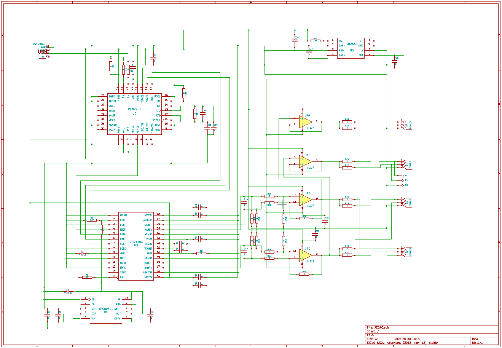
Entire circuit

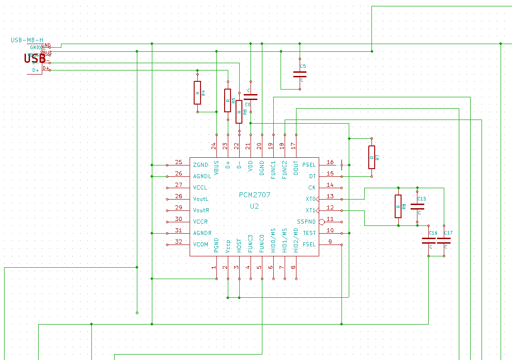
USB audio section with PCM2707

I realize the PCM2707 could be fed 3.3V externally and that could be an idea since it is already generated onboard, but it also has an internal regulator and only needs a capacitor to ground. Otherwise this is according to datasheet.
Note C15 is a crystal, not a capacitor. KiCAD did not have the symbol.

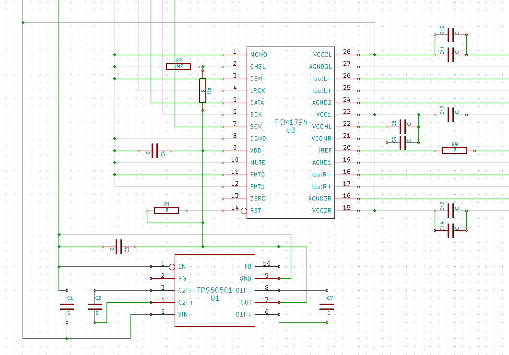
PCM1794 DAC and TPS60501 regulator section

Again, this is like in the datasheet. R2 is not a resistor but a jumper for selecting sharp or slow (default, open, as on PupDAC) filter rolloff. Decided to use separate capacitors on VCOML/R as in the datasheet even though PupDAC uses only one.
TPS60501 is a charge pump voltage regulator that feeds 3.3V to PCM1794.

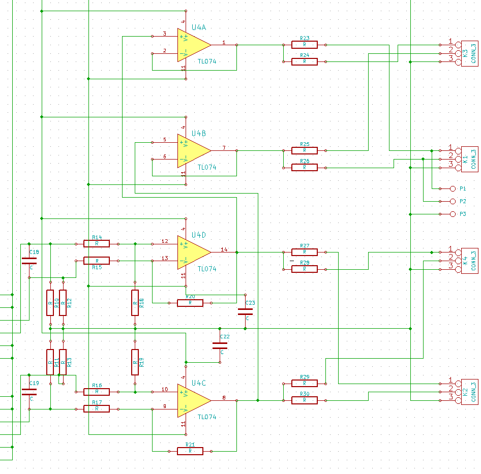
Analog stage

Similar to PupDAC but with lower gain (R18, R19, R20, R21). This approach is somewhat different than TI's solution with I/U buffers, and there are many opinions which is better. Output is also buffered for two of the outputs, to make use of all four amplifiers in the chip.

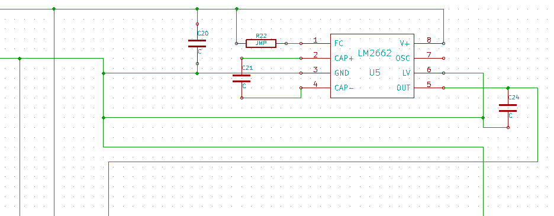
LM2662 section

Charge pump voltage inverter, creates -5V from 5V, necessary for the output opamp. Here again, R22 is a jumper and not a resistor. If open, the switching frequency will be 20 kHz. If closed, the frequency will be 150 kHz but the efficiency will be lower. Your choice, I hear no problem at 20 kHz.

### BOM and component values
U1: TPS60501
U2: PCM2707C
U3: PCM1794A
U4: OPA4134, TL074 or similar op-amp
U5: LM2662

R1, R3, R9: 10k
R2, R22: jumper (open)
R4, R7: 1k5
R8: 1M
R5, R6, R10, R11, R12, R13: 22R
R14, R15, R16, R17: 100R
R18, R19, R20, R21: 820R
R23, R24, R25, R26, R27, R28, R29, R30: 100R

C1: 4u7 elko
C2, C5, C6, C7: 1u polyester
C3, C10, C12, C14: 10u elko
C8, C9: 47u elko (- on pin, + on +5V)
C4, C11, C13, C20, C22, C23: 150n polyester
C15: 12 MHz crystal - used cap for simplicity in KiCAD
C16, C17: 4p7 (dependent on xtal capacitance, up to 33pF)
C18, C19: 220p ceramic
C21, C24: 47u elko low-ESR

USB connectors: used http://dx.com/p/diy-mini-usb-5-pin-female-90-degree-dip-socket-connector-silver-10-piece-pack-127646
RCA connectors: used http://dx.com/p/dual-sockets-3-5mm-av-jack-connectors-red-black-silver-10-pack-122545

### PCB design

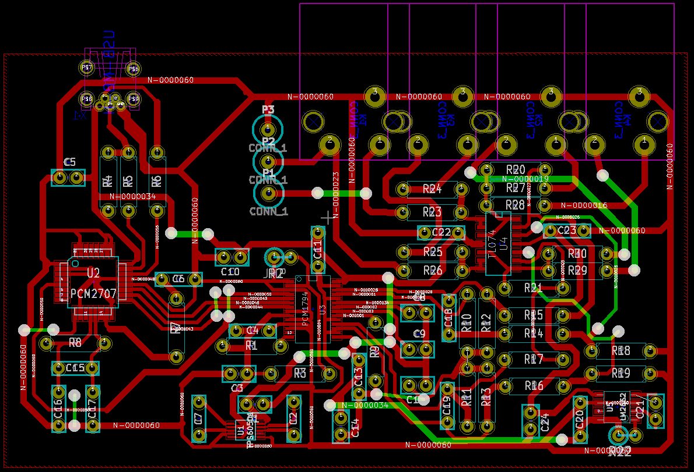
PCB design screenshot from KiCad.

Please review the design in KiCad (2013-may-18)-stable, picture only for illustrational purpose.
Layer B.Cu (green) are jump wires.
Filled area (ground potential) has been left out for clarity.
NOTE: Design has to be printed mirrored for toner transfer. Please ensure you get it right.

### Construction

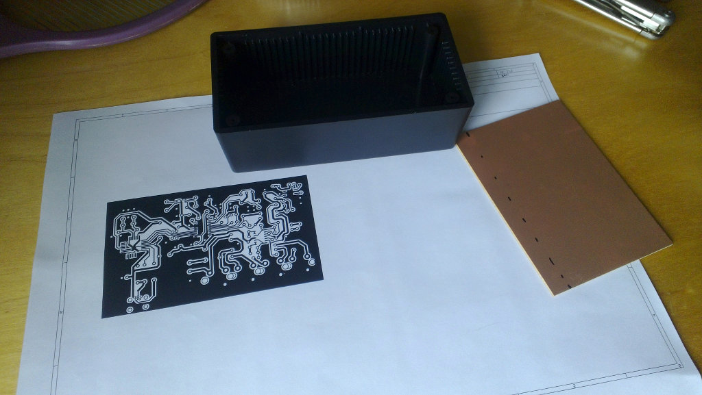
Designed the PCB to fit in a smallish box ([WCA-H2853](http://www.wishmaker.com.tw/cubecat/front/bin/ptlist.phtml?Category=218)).

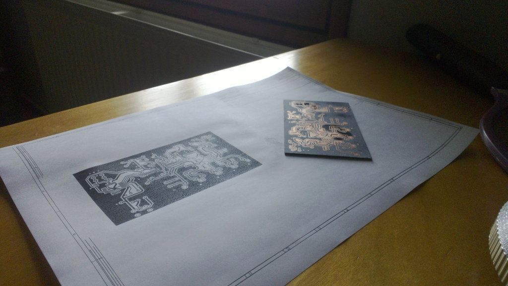
Toner transfer done with good results.

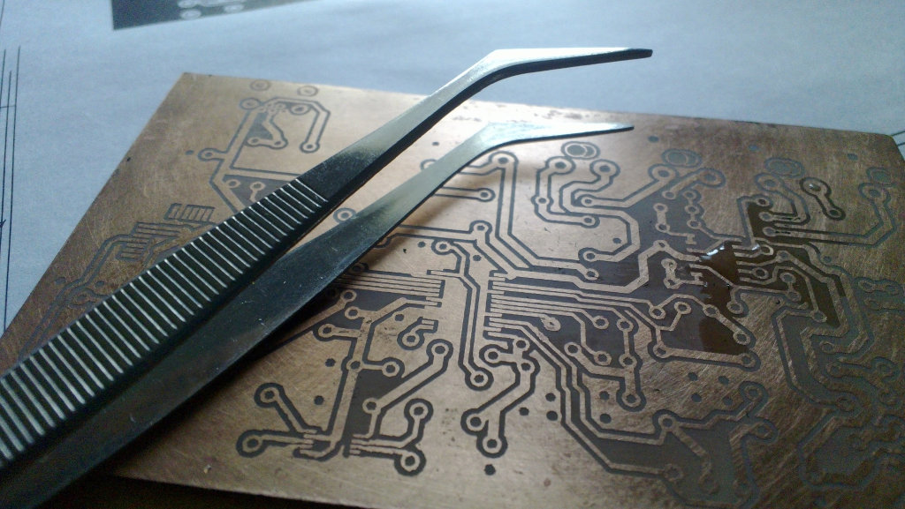
Board etched and even the finest traces are intact.

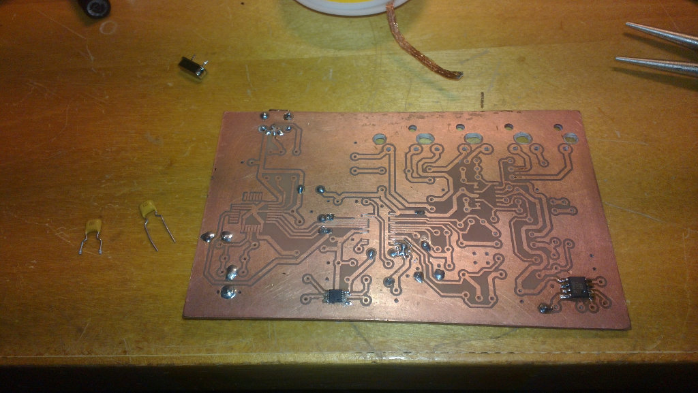
First surface mount components soldered; regulators that give 3.3V to DAC and -5V to opamp.

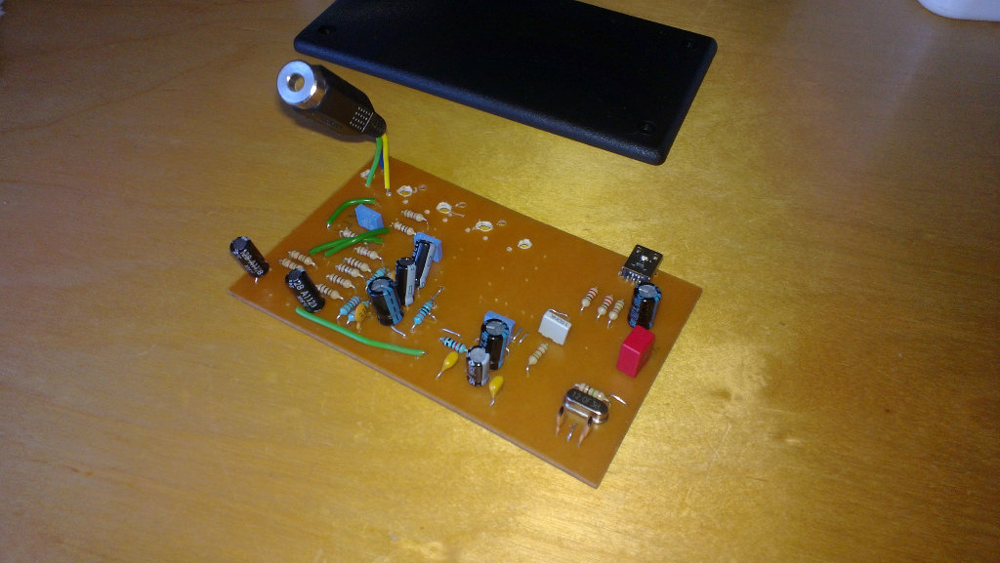
All the necessary components soldered and plugged in for a first test - and it works!

**Lesson of the day; electrolytic capacitors are bigger than you think.**

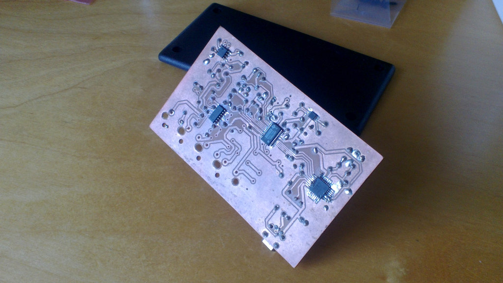
All the surface mount chips soldered.

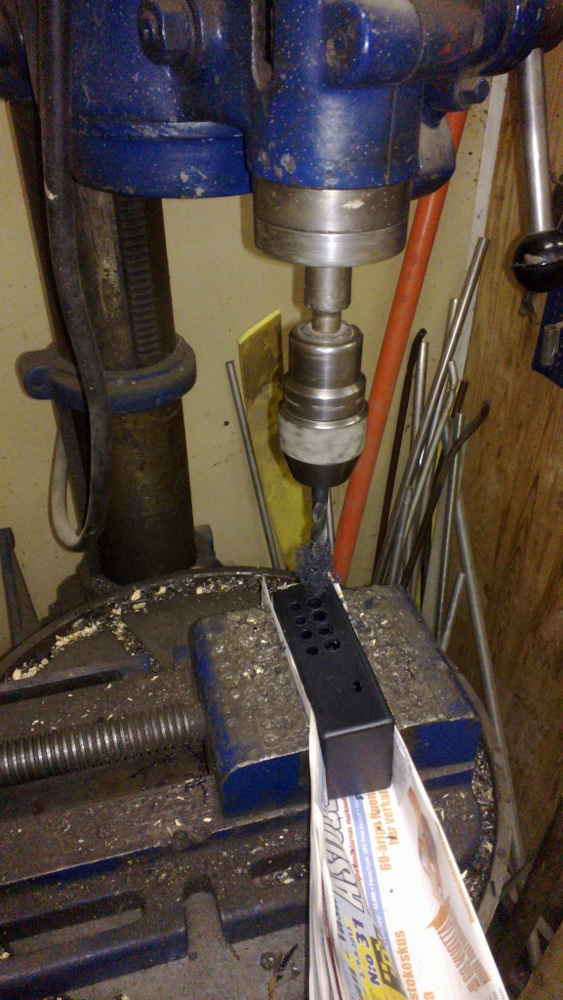
Preparing the box.

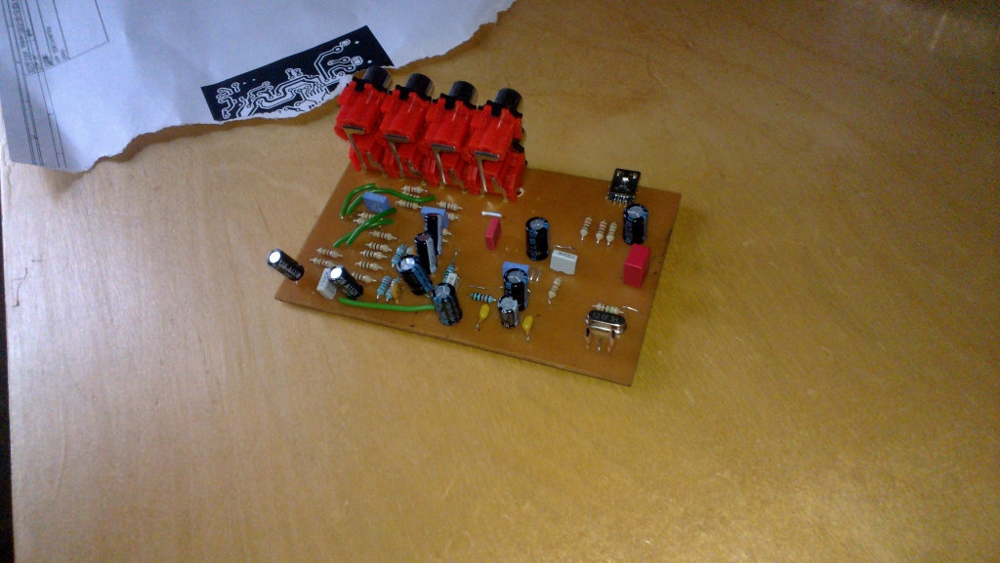
Board assembly completed with RCA jacks.

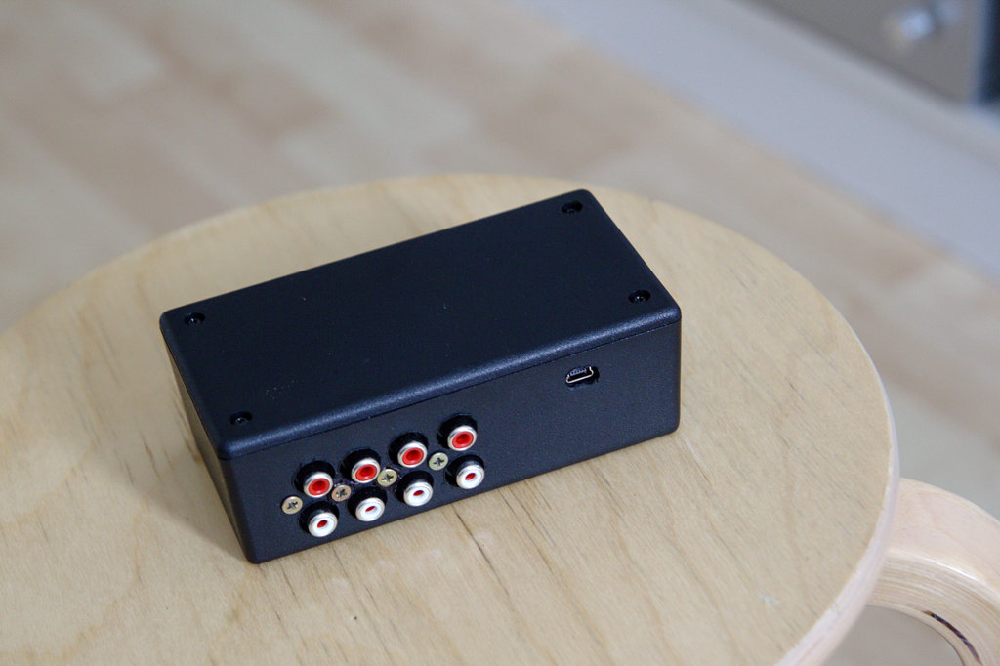
Finished DAC with four identical outputs and Mini-USB input.

## Downloads
[Schematic and PCB design in KiCad format.](files/JEDAC.tar.bz2)
[Linux/ALSA /etc/asound.conf with softvol configured.](files/asound.conf)

